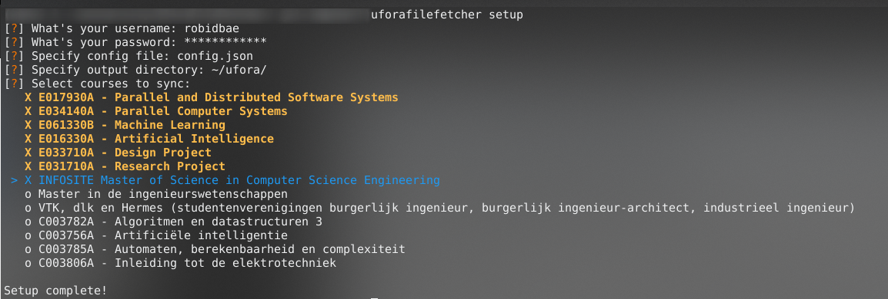
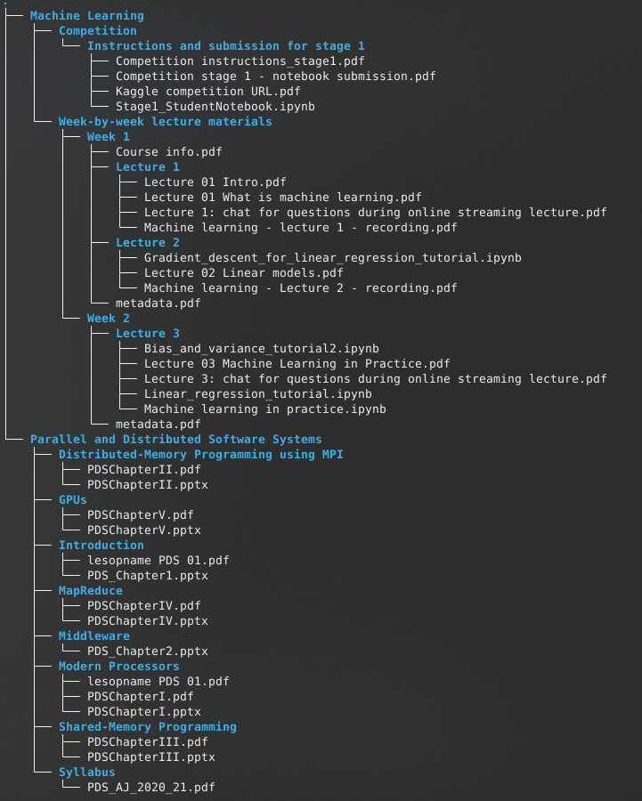

# UforaFileFetcher

A multithreaded Python tool to download files from [Ufora](https://ufora.ugent.be) (Brightspace) automatically using the BrightSpace API.
The tool can download files and create PDF summaries of metadata of files and modules.

**LICENSE**: [WTFPL](https://en.wikipedia.org/wiki/WTFPL)

## Setup
 
```
sudo apt install wkhtmltopdf
git clone https://github.com/RobinDeBaets/UforaFileFetcher
cd UforaFileFetcher
sudo python3 setup.py install
```

You can now run the setup.
```
uforafilefetcher setup
```



### Development environment

```
python3 -m venv venv
source venv/bin/activate
sudo pip install -e . 
```


## Usage

### Sync

Will sync the configured courses to the configured output directory. This will ignore files that have already been downloaded.

```
uforafilefetcher sync <config>
```




### List courses


```
uforafilefetcher courses <config>
```

### Download course

Will download a specific course to the specified output directory. Use the previous command to find out the id of your 
courses.

```
uforafilefetcher download <course_id> <config> [output_dir]
```

### Show help

```
uforafilefetcher help
```
